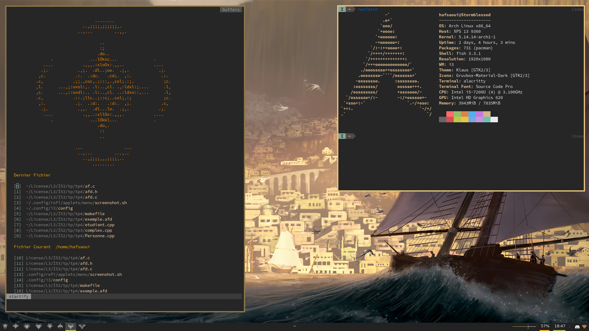

# dotfile Hafsaoui
My dotfile for different environement, I mainly use linux,vim/nvim,fish,i3

## Laptop
- arch
- nvim
- i3
- polybar
- Gruvbox <3
## Important command for my laptop
### fish
```shell
omf install bobthefish
omf theme_color_scheme gruvbox
curl -sL https://git.io/fisher | source && fisher install jorgebucaran/fisher
```

### font
```shell
sudo mv heraldstorm.ttf /usr/share/fonts/
yay nerd-fonts-complete
fc-cache -vf
```
### nvim
```shell
curl -fLo ~/.config/nvim/autoload/plug.vim --create-dirs https://raw.githubusercontent.com/junegunn/vim-plug/master/plug.vim```

